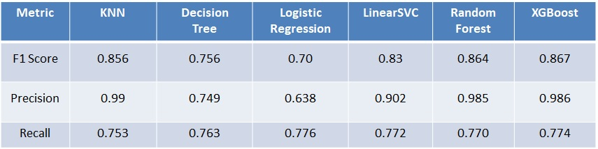
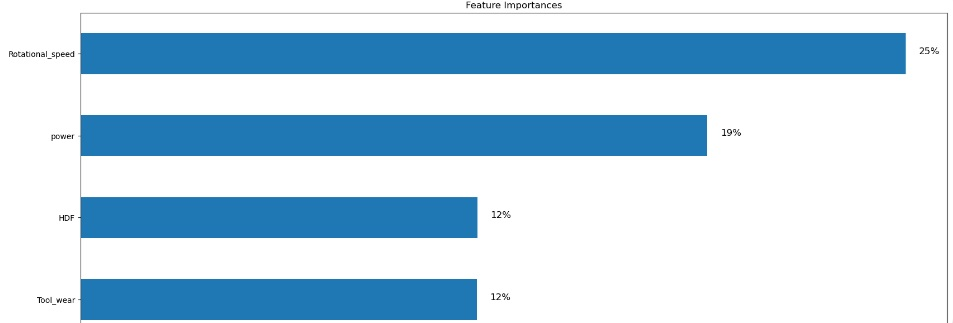
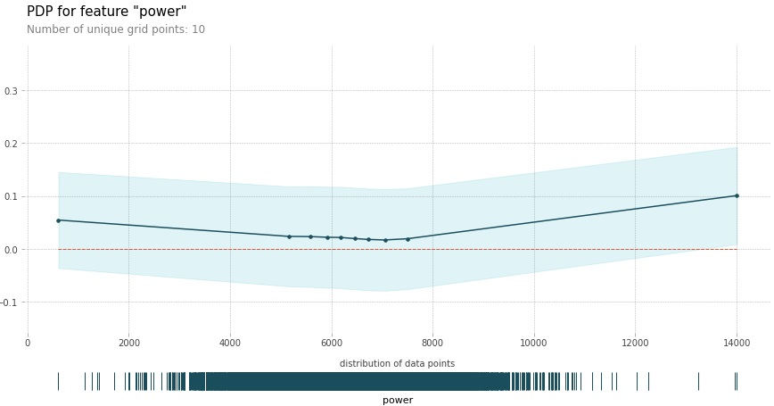
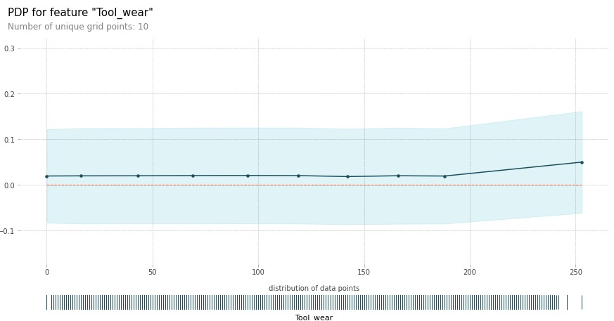

<!-- Improved compatibility of back to top link: See: https://github.com/othneildrew/Best-README-Template/pull/73 -->
<a name="readme-top"></a>
<!--
*** Thanks for checking out the Best-README-Template. If you have a suggestion
*** that would make this better, please fork the repo and create a pull request
*** or simply open an issue with the tag "enhancement".
*** Don't forget to give the project a star!
*** Thanks again! Now go create something AMAZING! :D
-->


<!-- PROJECT SHIELDS -->
<!--
*** I'm using markdown "reference style" links for readability.
*** Reference links are enclosed in brackets [ ] instead of parentheses ( ).
*** See the bottom of this document for the declaration of the reference variables
*** for contributors-url, forks-url, etc. This is an optional, concise syntax you may use.
*** https://www.markdownguide.org/basic-syntax/#reference-style-links
-->
[![Contributors][contributors-shield]][contributors-url]
[![Forks][forks-shield]][forks-url]
[![Stargazers][stars-shield]][stars-url]
[![Issues][issues-shield]][issues-url]
[![MIT License][license-shield]][license-url]
[![LinkedIn][linkedin-shield]][linkedin-url]


<!-- PROJECT LOGO -->
<br />
<div align="center">
  <a href="https://github.com/othneildrew/Best-README-Template">
    
  </a>

  <h3 align="center">Best-README-Template</h3>

  <p align="center">
    An awesome README template to jumpstart your projects!
    <br />
    <a href="https://github.com/othneildrew/Best-README-Template"><strong>Explore the docs »</strong></a>
    <br />
    <br />
    <a href="https://github.com/othneildrew/Best-README-Template">View Demo</a>
    ·
    <a href="https://github.com/othneildrew/Best-README-Template/issues">Report Bug</a>
    ·
    <a href="https://github.com/othneildrew/Best-README-Template/issues">Request Feature</a>
  </p>
</div>


## Table of Contents

1. [About the Work with Power-BI](#about-the-work-with-power-bi)
2. [Data preparation](#data-preparation)
3. [Categorical and Binary Features](#Categorial_and_binary_features)
4. [Role of product quality variants](#Role-of-product-quality-variants)
5. [Feature Distributions](#feature-distributions)
6. [Heatmap](#heatmap)
7. [Histograms](#histograms)
8. [Influences](#influences)
9. [Contact](#contact)


<!-- ABOUT THE WORK WITH POWER BI -->
## About The Work with Power BI

Introduction

This project was supported by the Power BI software that gives a good help in the exploratory data analysis and visualization. The dataset for this competition, train, had also been used  
This work is placed in the field of Data Science with application to the area of predictive maintenance. The need to have a way to determine whether or not a particular machine will fail, as well as the nature of the failure, is essential for generation 4.0 industries. The main reason lies behind the following consideration: the repair or replacement of a faulty machine generally requires costs that are much higher than those required for the replacement of a single component. Therefore, the installation of sensors that monitor the state of the machines, collecting the appropriate information, can lead to great savings for industries.


<!-- DATA PREPARATION -->
## Data set explaination
1) Task and Data description 
* Type: consisting of a letter L, M, or H for low, medium and high as product quality variants.
* air temperature [K]: generated using a random walk process later normalized to a standard deviation of 2 K around 300 K.
* process temperature [K]: generated using a random walk process normalized to a standard deviation of 1 K, added to the air temperature plus 10 K.
* rotational speed [rpm]: calculated from a power of 2860 W, overlaid with a normally distributed noise.
* Torque [Nm]: torque values are normally distributed around 40 Nm with a σ = 10 Nm and no negative values.
* Tool wear [min]: The quality variants H/M/L add 5/3/2 minutes of tool wear to the used tool in the process.
* Machine failure: whether the machine has failed in this particular datapoint for any of the following failure modes are true. The machine failure consists of five independent failure modes

* Tool wear failure (TWF): the tool will be replaced of fail at a randomly selected tool wear time between 200 ~ 240 mins.
* Heat dissipation failure (HDF): heat dissipation causes a process failure, if the difference between air and process temperature is below 8.6 K and the rotational speed is below 1380 rpm.
* Power failure (PWF): the product of torque and rotational speed (in rad/s) equals the power required for the process. If this power is below 3500 W or above 9000 W, the process fails.
* Overstrain failure (OSF): if the product of tool wear and torque exceeds 11,000 minNm for the L product variant (12,000 M, 13,000 H), the process fails due to overstrain.
* Random failures (RNF): each process has a chance of 0,1 % to fail regardless of its process parameters.

If at least one of the above failure modes is true, the process fails and the 'machine failure' label is set to 1. It is therefore not transparent to the machine learning method, which of the failure modes has caused the process to fail.


<!-- Categorical and Binary Features -->
## Data Preparation
Data preparation is a crucial phase in data science projects, encompassing various steps to ensure that raw data is transformed into a format suitable for analysis and modeling. Starting with the collection of relevant data from diverse sources, the process involves cleaning to handle missing values, outliers, and errors. Exploratory Data Analysis (EDA) is then conducted to gain insights into dataset characteristics, followed by feature engineering to enhance model performance through the creation or modification of features. Further steps include data transformation, handling categorical data, splitting the dataset into training and testing sets, scaling numerical features, and addressing imbalances in the target variable. Validation of the prepared dataset ensures alignment with project goals, contributing to the accuracy and effectiveness of subsequent machine learning or statistical modeling phases.
<!-- Training_test split -->
### Training_test split

In the initial stages of a data science project, it is recommended to split available data into a training set, focusing on tasks like exploration, cleaning, and feature engineering. At this point, test data specifics might not be defined.

The model should only be fitted to the training set during development, maintaining separation between training and test data. Test data, introduced later, simulates new entries into the data pipeline and evaluates the model's generalization abilities.

This approach ensures that the model is refined based on the training set's characteristics. The untouched test set is then used for a final evaluation, providing insights into real-world performance and the model's predictive capabilities on new, unseen data.
In this project we get 20% for test data set and 80% for train data set.
### Feature Engineering
#### Data Preprocessing for Model Training

In the data preprocessing phase, various transformations have been applied to optimize the dataset for model training. The following steps summarize the preprocessing actions:

#### 1. Distribution Categorization

We retained the top 10 distributions with the most data and grouped the remaining distributions into a single category to manage dataset diversity.

#### 2. One-Hot Encoding

Utilized One-Hot Encoding to convert categorical features into a suitable format for model training, particularly effective for non-ordinal categorical variables.

#### 3. Label Encoding for Ordinal Feature

Applied Label Encoding to the "Type" feature using the mapping {'L': 0, 'M': 1, 'H': 2}, preserving the ordinal nature of the categories.

#### 4. Creation of New Feature "Power"

Introduced a new feature, "Power," calculated as the product of torque (τ) and rotational speed (ω). The formula used is P = τ * ω, where P represents power.

#### 5. PCA for Highly Correlated Features

Applied Principal Component Analysis (PCA) to address high correlation between features 'Air_temperature' and 'Process_Temperature.' Extracted 90% of the variance to reduce dimensionality.

#### 6. Feature Selection

Identified and dropped irrelevant or redundant columns to streamline the dataset. Excluded columns are "Product_ID," "Type," "id," and "Torque."

These preprocessing steps contribute to a refined and informative dataset, optimizing it for machine learning algorithms. The combination of encoding techniques, feature creation, and dimensionality reduction enhances model performance and interpretability.
 

<!-- Model training -->
## Model training
In this section, we tested various models like K-Nearest Neighbors (KNN), XGBoost, Logistic Regression, Support Vector Classifier (SVC), Random Forest, and Decision Tree. We carefully trained and evaluated each model, addressing tasks such as data preparation and scaling. A systematic pipeline was followed, and fine-tuning through Grid Search Hyperparameter optimization helped us identify the most effective model among these options. This thorough process boosts our confidence in the chosen model's reliability and performance in the overall evaluation.




<!-- Model Interpretation -->
## Model Interpretation

Partial Dependence Plots (PDP) and feature importance analysis provide valuable insights into the relationships between individual features and model predictions.

* Partial Dependence Plots (PDP): PDPs illustrate the impact of a specific feature on the model's predictions while keeping other features constant. By systematically varying the chosen feature and observing its influence on the predicted outcome, PDPs help visualize and interpret the model's behavior.

* Feature Importance Analysis: This analysis quantifies the significance of each feature in influencing the model's predictions. Common methods include calculating feature importances based on tree-based models or permutation importance. Feature importance allows practitioners to identify which features contribute the most to the model's decision-making process.

Together, PDPs and feature importance analysis provide a comprehensive understanding of the relationships between input features and model outcomes, aiding interpretability and guiding further investigations in data science projects.

1) Feature importance

In this diagram, you can see the importance of features based on Gini Impurity in Random Forest model, and as you can see, there are 4 features that have the most influence on dividing target values.



2) PDP plot

As it can be seen, with the increase in power from 8000 watts, the average probability of machine failure increases.



You can also see the effect of tool wear with an increase of more than 200 minutes.




Use the `BLANK_README.md` to get started.

<p align="right">(<a href="#readme-top">back to top</a>)</p>


## Built With

- [Python](https://www.python.org/)
- [NumPy](https://numpy.org/)
- [Pandas](https://pandas.pydata.org/)
- [Scikit-learn](https://scikit-learn.org/)
- [Matplotlib](https://matplotlib.org/)
- [Seaborn](https://seaborn.pydata.org/)
- [Jupyter Notebooks](https://jupyter.org/)
- [Principal Component Analysis (PCA)](https://scikit-learn.org/stable/modules/generated/sklearn.decomposition.PCA.html)


<p align="right">(<a href="#readme-top">back to top</a>)</p>


<!-- GETTING STARTED -->
## Getting Started

This is an example of how you may give instructions on setting up your project locally.
To get a local copy up and running follow these simple example steps.

### Prerequisites

This is an example of how to list things you need to use the software and how to install them.
* npm
  ```sh
  npm install npm@latest -g
  ```

### Installation

_Below is an example of how you can instruct your audience on installing and setting up your app. This template doesn't rely on any external dependencies or services._

1. Get a free API Key at [https://example.com](https://example.com)
2. Clone the repo
   ```sh
   git clone https://github.com/your_username_/Project-Name.git
   ```
3. Install NPM packages
   ```sh
   npm install
   ```
4. Enter your API in `config.js`
   ```js
   const API_KEY = 'ENTER YOUR API';
   ```

<p align="right">(<a href="#readme-top">back to top</a>)</p>


<!-- USAGE EXAMPLES -->
## Usage

Use this space to show useful examples of how a project can be used. Additional screenshots, code examples and demos work well in this space. You may also link to more resources.

_For more examples, please refer to the [Documentation](https://example.com)_

<p align="right">(<a href="#readme-top">back to top</a>)</p>


<!-- ROADMAP -->
## Roadmap

- [x] Add Changelog
- [x] Add back to top links
- [ ] Add Additional Templates w/ Examples
- [ ] Add "components" document to easily copy & paste sections of the readme
- [ ] Multi-language Support
    - [ ] Chinese
    - [ ] Spanish

See the [open issues](https://github.com/othneildrew/Best-README-Template/issues) for a full list of proposed features (and known issues).

<p align="right">(<a href="#readme-top">back to top</a>)</p>


<!-- CONTRIBUTING -->
## Contributing

Contributions are what make the open source community such an amazing place to learn, inspire, and create. Any contributions you make are **greatly appreciated**.

If you have a suggestion that would make this better, please fork the repo and create a pull request. You can also simply open an issue with the tag "enhancement".
Don't forget to give the project a star! Thanks again!

1. Fork the Project
2. Create your Feature Branch (`git checkout -b feature/AmazingFeature`)
3. Commit your Changes (`git commit -m 'Add some AmazingFeature'`)
4. Push to the Branch (`git push origin feature/AmazingFeature`)
5. Open a Pull Request

<p align="right">(<a href="#readme-top">back to top</a>)</p>


<!-- LICENSE -->
## License

Distributed under the MIT License. See `LICENSE.txt` for more information.

<p align="right">(<a href="#readme-top">back to top</a>)</p>


<!-- CONTACT -->
## Contact

Your Name  - f.ashrafi71@yahoo.com

Project Link: [https://github.com/farnazashrafi/portfolio_project](https://github.com/farnazashrafi/portfolio_project)

<p align="right">(<a href="#readme-top">back to top</a>)</p>


<!-- ACKNOWLEDGMENTS -->
## Acknowledgments

Use this space to list resources you find helpful and would like to give credit to. I've included a few of my favorites to kick things off!

* [Choose an Open Source License](https://choosealicense.com)
* [GitHub Emoji Cheat Sheet](https://www.webpagefx.com/tools/emoji-cheat-sheet)
* [Malven's Flexbox Cheatsheet](https://flexbox.malven.co/)
* [Malven's Grid Cheatsheet](https://grid.malven.co/)
* [Img Shields](https://shields.io)
* [GitHub Pages](https://pages.github.com)
* [Font Awesome](https://fontawesome.com)
* [React Icons](https://react-icons.github.io/react-icons/search)

<p align="right">(<a href="#readme-top">back to top</a>)</p>


<!-- MARKDOWN LINKS & IMAGES -->
<!-- https://www.markdownguide.org/basic-syntax/#reference-style-links -->
[contributors-shield]: https://img.shields.io/github/contributors/othneildrew/Best-README-Template.svg?style=for-the-badge
[contributors-url]: https://github.com/othneildrew/Best-README-Template/graphs/contributors
[forks-shield]: https://img.shields.io/github/forks/othneildrew/Best-README-Template.svg?style=for-the-badge
[forks-url]: https://github.com/othneildrew/Best-README-Template/network/members
[stars-shield]: https://img.shields.io/github/stars/othneildrew/Best-README-Template.svg?style=for-the-badge
[stars-url]: https://github.com/othneildrew/Best-README-Template/stargazers
[issues-shield]: https://img.shields.io/github/issues/othneildrew/Best-README-Template.svg?style=for-the-badge
[issues-url]: https://github.com/othneildrew/Best-README-Template/issues
[license-shield]: https://img.shields.io/github/license/othneildrew/Best-README-Template.svg?style=for-the-badge
[license-url]: https://github.com/othneildrew/Best-README-Template/blob/master/LICENSE.txt
[linkedin-shield]: https://img.shields.io/badge/-LinkedIn-black.svg?style=for-the-badge&logo=linkedin&colorB=555
[linkedin-url]: https://linkedin.com/in/othneildrew
[product-screenshot]: images/screenshot.png
[Next.js]: https://img.shields.io/badge/next.js-000000?style=for-the-badge&logo=nextdotjs&logoColor=white
[Next-url]: https://nextjs.org/
[React.js]: https://img.shields.io/badge/React-20232A?style=for-the-badge&logo=react&logoColor=61DAFB
[React-url]: https://reactjs.org/
[Vue.js]: https://img.shields.io/badge/Vue.js-35495E?style=for-the-badge&logo=vuedotjs&logoColor=4FC08D
[Vue-url]: https://vuejs.org/
[Angular.io]: https://img.shields.io/badge/Angular-DD0031?style=for-the-badge&logo=angular&logoColor=white
[Angular-url]: https://angular.io/
[Svelte.dev]: https://img.shields.io/badge/Svelte-4A4A55?style=for-the-badge&logo=svelte&logoColor=FF3E00
[Svelte-url]: https://svelte.dev/
[Laravel.com]: https://img.shields.io/badge/Laravel-FF2D20?style=for-the-badge&logo=laravel&logoColor=white
[Laravel-url]: https://laravel.com
[Bootstrap.com]: https://img.shields.io/badge/Bootstrap-563D7C?style=for-the-badge&logo=bootstrap&logoColor=white
[Bootstrap-url]: https://getbootstrap.com
[JQuery.com]: https://img.shields.io/badge/jQuery-0769AD?style=for-the-badge&logo=jquery&logoColor=white
[JQuery-url]: https://jquery.com 
